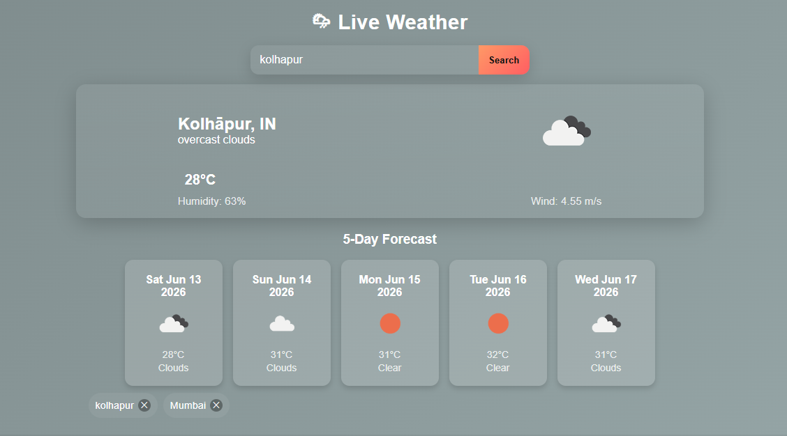

# 🌦️ Weather Forecast App

## 📌 Project Overview

A real-time weather forecasting application built using React and the OpenWeatherMap API. The application allows users to search for any city and view current weather conditions along with forecast information through a clean and responsive user interface.

## 🛠️ Tech Stack

### ⚛️ Frontend
- React.js
- JavaScript
- CSS

### 🌐 API
- OpenWeatherMap API

## 📸 Screenshot

### 🌦️ Weather Forecast Application

